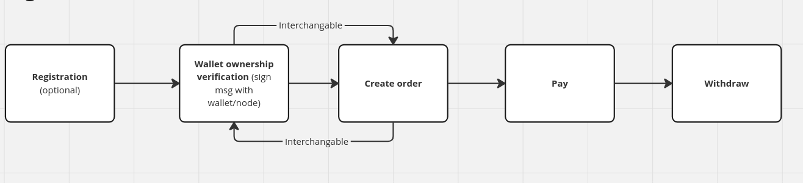

# FLS01 Fiat On-ramp 

| Name    	| `fiat_on_ramp`             |
|---------- |------------------------------	|
| Version 	| 0.1                           |
| Status    | Draft                         |

## Motivation
The goal of this specification is to provide standardized API for applications to purchase bitcoin. This will make integrations simple and providers compatible, enabling wider adoption.

## High level flow

## API endpoints 

| Name      	 | function                | status | type |
|----------------|-------------------------|--------|-------|
| /auth/register | user registration       | optional| POST | 
| /auth/verify   | verify wallet ownership | required | GET |
| /order         | place order             | required | POST|
| /orders        | get user orders         | required | GET |
